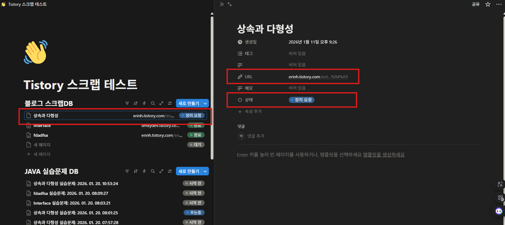

# 🎓 n8n 기반 학습 큐레이터
### Notion & Blog Learning Content Automation
> 노션 페이지와 블로그의 방대한 정보를 분석하여  
> **학습에 최적화된 콘텐츠로 자동 변환**하는 n8n 기반 학습 자동화 시스템입니다.

## 목차

[1. 프로젝트 개요](#1-프로젝트-개요)

[2. 주요 기능](#2-주요-기능)

[3. 사용 방법](#3-사용-방법)

[4. 워크플로우](#4-워크플로우)

[5. 트러블슈팅](#5-트러블슈팅)

[6. 기술 스택](#6-기술-스택)

##  1. 프로젝트 개요

우리는 새로운 기술을 학습하거나 특정 문제를 해결해야 할 때
기술 블로그나 공식 문서와 같은 온라인 자료를 참고합니다.

하지만 대부분의 경우,
해당 글을 **한 번 읽고 문제를 해결한 뒤 곧바로 넘기거나**,  
혹은 **북마크에 저장해 두고 다시 찾아보지 않는 경우가 많습니다.**

이러한 학습 방식은 지식이 **일회성으로 소비**되고,  
실제 역량으로 축적되지 않는다는 한계를 가집니다.

본 프로젝트는 이러한 문제를 해결하기 위해  
**Notion + n8n + AI API**를 활용하여  
외부 기술 블로그 및 학습 콘텐츠를 자동으로 분석하고,  
요약 · 실습 문제 · 코드 리팩토링 · 학습 알림까지  
하나의 학습 사이클로 통합하여 자동화한 **개인 학습 큐레이터 시스템**을 제안합니다.

사용자는 노션 데이터베이스에 학습할 URL 혹은 코드를 입력하고  
상태를 `정리 요청`으로 변경하는 것만으로,  
AI가 학습에 최적화된 형태로 콘텐츠를 재구성하고 학습 진행 여부에 따라 자동으로 알림을 제공합니다.

이 프로젝트는 단순히 학습 자료를 **일회성으로 소비하는 것이 아닌**,
**완전히 이해**하고 자신의 지식으로 소화하게끔 돕는 것을 목표로 합니다.

##  2. 주요 기능

- 📄 **기술블로그 콘텐츠 요약**

- 🧠 **핵심 개념 기반 실습 문제 자동 생성**

- 🛠 **코드 리팩토링**

- 🔔 **처리 상태 기반 자동 알림**

##  3. 사용 방법

### 📝 사전 준비

### a. 노션 데이터베이스 생성

- **URL** : 정리할 페이지의 링크

- **상태** : `정리 요청` → `처리중` → `완료`

### b. 외부 API 키 준비

- 🔑 **Notion API**  
  → [Notion Developers](https://www.notion.so/my-integrations)

- 🔑 **Gemini API (or 다른 AI API)**  
  → [Google AI Studio](https://aistudio.google.com/)

### ▶️ 실행 방법

1. 노션 데이터베이스에 새 페이지를 생성합니다.

2. `URL` 속성에 정리할 블로그 링크를 입력합니다.

3. 페이지 내부 **Code Block**에 리팩토링할 코드를 작성합니다.

4. 상태를 **`정리 요청`** 으로 변경합니다.

🔥 **n8n 워크플로우가 자동 실행됩니다.**

##  4. 워크플로우

### 1️⃣ 기술블로그 콘텐츠 요약

### 2️⃣ 핵심 개념 기반 실습 문제 자동 생성

### 3️⃣ 코드 리팩토링

### 4️⃣ 처리 상태 기반 자동 알림

##  5. 트러블슈팅

### ⚠️ n8n 기본 Notion 노드의 한계와 해결 방법

Notion에 학습 콘텐츠를 **가독성 높게 저장하기 위해**,  
기본 Notion 노드 대신 **Notion API를 직접 호출(HTTP Request)** 하는 방식을 적용했습니다.

---

### 1️⃣ 단일 블록 제약으로 인한 가독성 저하

- **문제**  
  긴 AI 응답을 하나의 노션 블록에 저장할 경우,  
  헤딩 · 목록 등의 구조가 유지되지 않아 가독성이 크게 저하되었습니다.

- **해결**  
  AI 응답을 줄 단위로 파싱하여  
  `heading`, `bulleted_list_item`, `paragraph` 등 **적절한 블록 타입으로 분리 생성**하도록 구현했습니다.

---

### 2️⃣ 마크다운 서식 미지원 문제

- **문제**  
  AI가 출력한 `**bold**`, `_italic_` 등의 마크다운 문법이  
  노션에서 서식 없이 텍스트로 표시되었습니다.

- **해결**  
  Rich Text Object의 annotations 속성(`bold`, `italic` 등)을 직접 구성하여  
  **노션 API 기준에 맞게 서식을 변환**했습니다.

---

### 3️⃣ 노션 블록 글자 수 제한(≈4,000자) 문제

- **문제**  
  단일 블록의 글자 수 제한으로 인해  
  긴 학습 콘텐츠가 중간에 잘리는 현상이 발생했습니다.

- **해결**  
  콘텐츠 길이를 사전에 계산하여  
  제한 초과 시 **자동으로 블록을 분할**하여 저장하도록 처리했습니다.

---

### 4️⃣ 코드 블록(Code Block) 생성 불가 문제

- **문제**  
  n8n의 `Create Database Page` 노드는 **Code Block 생성을 지원하지 않습니다.**

- **해결**  
  n8n의 기본 Notion 노드 대신 HTTP Request 노드를 사용하여  
  Notion Blocks API(`/v1/blocks/{block_id}/children`)를 호출함으로써  
  **코드 블록을 정상적으로 생성**할 수 있도록 구현했습니다.

---
## 🛠️ 기술 스택

